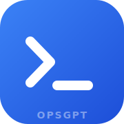
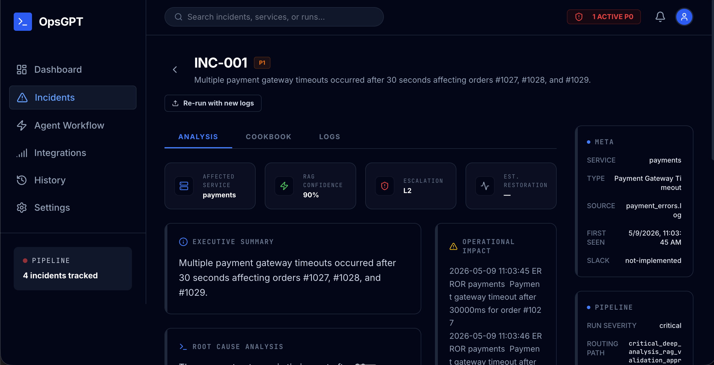
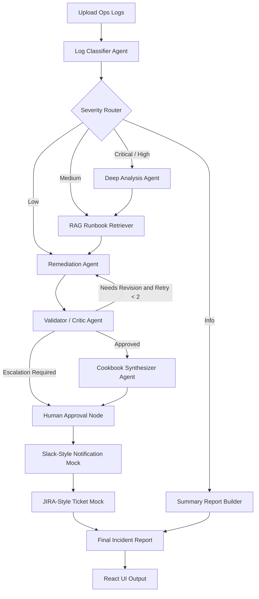

<div align="center">



# OpsGPT

### Multi-Agent DevOps Incident Analysis Suite

Upload ops logs → 8-node LangGraph DAG classifies incidents, retrieves runbook evidence, generates RAG-grounded fixes, validates them, and renders a final markdown report — surfaced through a polished React dashboard.

**[🌐 Live Demo](https://opsgpt.joysontech.com)** · **[📖 API Reference](#-api-reference)** · **[🚀 Setup](#-quick-start)** · **[🎬 Demo Script](docs/demo_script.md)**

<br>

[](https://github.com/joyson-fernandes/C6_Hackathon-Group-4/actions/workflows/ci.yaml)
[](https://opensource.org/licenses/MIT)
[](https://github.com/joyson-fernandes/C6_Hackathon-Group-4)
[](https://opsgpt.joysontech.com)

<br>

[](https://www.python.org/)
[](https://nodejs.org/)
[](https://fastapi.tiangolo.com/)
[](https://github.com/langchain-ai/langgraph)
[](https://smith.langchain.com)
[](https://docs.pydantic.dev/)
[](https://react.dev/)
[](https://vitejs.dev/)
[](https://www.typescriptlang.org/)
[](https://tailwindcss.com/)
[](https://ui.shadcn.com/)
[](https://www.framer.com/motion/)

<br>

[](Dockerfile)
[](deploy/chart)
[](deploy/chart)
[](deploy/argocd/application.yaml)
[](https://goharbor.io/)
[](https://cert-manager.io/)
[](https://traefik.io/)

</div>

<br>

---

## 🖼 Screenshot

<div align="center">



*Live-demo view of `payment_errors.log` analyzed: severity = **critical**, RAG confidence 90%, escalation L2, full pipeline metadata in the right rail. Try it yourself at [opsgpt.joysontech.com](https://opsgpt.joysontech.com).*

</div>

---

## 📖 Table of Contents

- [🖼 Screenshot](#-screenshot)
- [✨ What it does](#-what-it-does)
- [🏗 Architecture](#-architecture)
- [🚀 Quick start](#-quick-start)
- [📡 API reference](#-api-reference)
- [🤖 How the agents work](#-how-the-agents-work)
- [🧪 Tests & evals](#-tests--evals)
- [📊 Sample outputs](#-sample-outputs)
- [⚙️ Environment variables](#️-environment-variables)
- [🚢 Deployment](#-deployment)
- [📁 Project layout](#-project-layout)
- [🐛 Troubleshooting](#-troubleshooting)
- [👥 Contributing](#-contributing)
- [📜 License](#-license)

---

## ✨ What it does

You drop a log file. The system:

| Step | Agent | What happens |
|---|---|---|
| 1️⃣ | **Classifier** | Pulls every distinct incident — service, error type, severity, evidence — using structured Pydantic output |
| 2️⃣ | **Severity Router** | Routes the run by aggregate severity. `critical`/`high` → deep analysis + RAG. `medium` → RAG. `low` → standard remediation. `info` → summary-only path |
| 3️⃣ | **Deep Analysis** *(critical/high)* | Extra correlation + dependency hints |
| 4️⃣ | **RAG Retriever** | BM25 over markdown runbooks in `knowledge_base/` — grabs top-3 snippets with relevance score |
| 5️⃣ | **Remediation** | LLM call grounded in RAG context produces `Fix(rationale, ordered steps, risk, runbook_ref)` per incident |
| 6️⃣ | **Validator / Critic** | Scores the remediation 0–10. Returns `approved`, `needs_revision` (loop back ≤ 2 retries), or `escalate` |
| 7️⃣ | **Cookbook Synthesizer** | One LLM call over all incidents + fixes → consolidated checklist |
| 8️⃣ | **Human Approval Gate** | Workflow control gate that flags critical incidents for operator approval |
| 9️⃣ | **Slack Notifier** *(mock)* | Demo-safe Slack-style output (`sent_mock`, `#sre-incidents`, threaded message preview) |
| 🔟 | **JIRA Ticketer** *(mock)* | Demo-safe JIRA-style output (`OPS-1001`, priority, summary, description) |
| 1️⃣1️⃣ | **Report Builder** | Pure-Python: walks state, renders one markdown string |

All orchestrated as a LangGraph DAG with conditional routing. Surfaced through a React dashboard with **dark / light / system** theme, ⌘K command palette, real-time token-cost tracking, and per-node detail panels.

### 🎯 Highlights

- **Multi-agent LangGraph workflow** with conditional routing — not a single mega-prompt
- **Severity-based branching** (critical / high / medium / low / info) so cheap incidents stay cheap
- **RAG-grounded fixes** (BM25 over `knowledge_base/`) — every recommendation cites its runbook
- **Validator critic loop** — quality scoring with retry logic up to 2 attempts before escalation
- **LangSmith tracing** — every agent call + LangGraph node appears in the dashboard with cost
- **Live token-cost tracking** — per-run USD cost computed from OpenRouter pricing, surfaced in the UI
- **Top-tier dashboard UI** — shadcn/ui pattern, Geist fonts, HSL design tokens, dark/light/system theme, Cmd+K palette, animated counters, sparklines
- **Production deployment** — Docker → Harbor → ArgoCD → K8s with Traefik + Let's Encrypt
- **22-test pytest suite** for the deterministic router + validator (no LLM calls)

---

## 🏗 Architecture

### Stack at a glance

| Layer | Tech |
|---|---|
| **Frontend** | React 19 · Vite 6 · TypeScript 5.8 · Tailwind v4 · shadcn/ui (Radix + cva) · Framer Motion · Geist font · cmdk · sonner · Recharts |
| **Backend** | FastAPI · LangGraph · langchain-openai (via OpenRouter) · Pydantic v2 · BM25 RAG |
| **Infrastructure** | Docker · Helm · ArgoCD · Traefik IngressRoute · cert-manager (Let's Encrypt) · Harbor registry |
| **CI/CD** | GitHub Actions (self-hosted runner) · Trivy · automatic chart bump |
| **Observability** | LangSmith (tracing + cost) · per-run usage tracker · K8s liveness probes |

### Pipeline DAG



> **Production-ready human-in-the-loop.** The `human_approval` node currently flags `human_approval_status: "required"` and continues so the demo runs end-to-end without blocking. Swapping the node body for `langgraph.types.interrupt` makes it a true blocking gate that resumes only when an operator clicks Approve — no edges or downstream nodes need to change.

---

## 🚀 Quick start

### Prerequisites

| Requirement | Get it |
|---|---|
| Python 3.11+ | [python.org/downloads](https://www.python.org/downloads/) |
| Node 20+ | [nodejs.org](https://nodejs.org/) |
| OpenRouter API key | Sign up free at [openrouter.ai](https://openrouter.ai), copy from [/keys](https://openrouter.ai/keys) |

### One-shot setup

```bash
git clone https://github.com/joyson-fernandes/C6_Hackathon-Group-4.git
cd C6_Hackathon-Group-4

# Backend
python3 -m venv .venv
source .venv/bin/activate
pip install -r requirements.txt
cp .env.example .env
# Open .env and paste your OPENROUTER_API_KEY

# Frontend
cd web
npm install
cp .env.example .env
cd ..
```

### Run (two terminals)

**Backend** — `uvicorn`:
```bash
source .venv/bin/activate
uvicorn app.server:app --reload --port 8000
# → http://localhost:8000/api/health
# → http://localhost:8000/docs (Swagger)
```

**Frontend** — Vite:
```bash
cd web && npm run dev
# → http://localhost:3000
```

### CLI smoke test (no UI)

```bash
curl -s -X POST http://localhost:8000/api/analyze \
  -H 'Content-Type: application/json' \
  --data "$(jq -Rs '{logs: .}' < Sample_logs/payment_errors.log)" \
  | jq '.incidents | length, .rag_confidence, .usage.total_cost_usd'
```

Should print: an incident count, one of `high|medium|low|none`, and a USD cost like `0.029712`.

### Or just use the live demo

🌐 **[opsgpt.joysontech.com](https://opsgpt.joysontech.com)** — paste your OpenRouter key in **Settings**, drop a `Sample_logs/*.log` from this repo, and watch the pipeline run.

### Convenience targets (`Makefile`)

```bash
make setup         # Install Python + frontend deps in one shot
make test          # 22-test pytest suite (no LLM calls)
make eval          # Scenario evals against Sample_logs/
make smoke         # Confirm the LangGraph compiles cleanly
make run           # Start FastAPI on :8000
make frontend      # Start Vite dev server (separate terminal)
```

---

## 📡 API reference

### `POST /api/analyze`

Body: `{ "logs": "<raw log text>" }`. Optional headers:
- `X-OpenRouter-API-Key` — per-request OpenRouter key (overrides server default)
- `X-OpenRouter-Model` — per-request model id (e.g. `openai/gpt-4o`)
- `X-LangSmith-API-Key` — per-request LangSmith key

Response shape (TypeScript — see `web/src/types/incident.ts` for the full type):

```ts
{
  incidents: BackendIncident[],            // classifier output
  remediations: Record<string, BackendFix>, // keyed by incident.id
  cookbook: BackendChecklist | null,       // consolidated runbook
  report_md: string,                        // pre-rendered markdown report

  // Severity routing
  severity: 'critical' | 'high' | 'medium' | 'low' | 'info' | null,
  routing_path: string | null,
  flags: { requires_deep_analysis, requires_rag, requires_human_approval, ... },

  // RAG payload
  rag_sources: string[],
  rag_confidence: 'high' | 'medium' | 'low' | 'none',
  rag_compliance: RagComplianceEntry[],

  // Validator
  validator_status: 'approved' | 'needs_revision' | 'escalate' | null,
  quality_score: number | null,            // 0..10
  retry_count: number,
  issues_found: string[],

  // Token + USD cost (live, computed from OpenRouter pricing)
  usage: {
    llm_calls: number,
    total_tokens_input: number,
    total_tokens_output: number,
    total_tokens: number,
    total_cost_usd: number,                // e.g. 0.029712
    models_used: string[]
  },

  // Human approval + execution trace
  human_approval_status: 'required' | 'approved' | 'skipped' | null,
  execution_path: string[],                // ordered list of nodes visited

  // Mock notifier output
  slack_status: 'sent_mock' | 'prepared_mock' | 'skipped',
  slack_thread_ts: string | null,
  slack_message_preview: string,
  jira_status: 'created_mock' | 'skipped',
  jira_keys: string[]
}
```

### `GET /api/health`

```json
{ "status": true, "server_key_configured": true }
```

### `GET /healthz`

K8s probe target. Returns `{"status":"ok"}`.

---

## 🤖 How the agents work

| Agent | File | LLM? | What it returns |
|---|---|:-:|---|
| **Classifier** | `agents/classifier.py` | ✅ | `IncidentList` — structured Pydantic output, dedupes near-duplicates |
| **Severity Router** | `agents/severity_router.py` | ❌ | Pure-Python — sets routing flags + path string |
| **Deep Analysis** | `agents/graph.py::deep_analysis` | ❌ | Stub trace marker; ready for correlation logic |
| **RAG Retriever** | `agents/rag.py` + `graph.py::rag_retriever` | ❌ | BM25 top-K snippets from `knowledge_base/` |
| **Remediation** | `agents/remediation.py` | ✅ | `Fix(rationale, steps, risk, runbook_ref)` per incident |
| **Validator** | `agents/validator.py` | ❌ | Pure-Python rubric scoring — `approved` / `needs_revision` / `escalate` + quality 0–10 |
| **Cookbook** | `agents/cookbook.py` | ✅ | One consolidated `Checklist` over all fixes |
| **Slack Notifier** | `agents/notifier.py::notify_slack` | ❌ | Demo-safe mock — realistic Slack metadata, no API call |
| **JIRA Ticketer** | `agents/notifier.py::file_jira` | ❌ | Demo-safe mock — `OPS-1001`-style keys, no API call |
| **Report Builder** | `agents/graph.py::build_report` | ❌ | Walks state, renders markdown |

State flow: `agents/models.py::State` is a TypedDict threaded through every node. Each node returns a partial dict that LangGraph merges into the running state.

### Severity-based RAG policy

```
critical  → mandatory  (missing evidence ⇒ fail)
high      → strongly_preferred  (missing evidence ⇒ warn)
medium    → preferred
low/info  → optional
```

Enforced post-generation in `agents/remediation.py::_evaluate_rag_compliance`.

---

## 🧪 Tests & evals

### Unit tests — pure Python, no LLM calls

```bash
pip install pytest
pytest -q
```

22 tests covering every routing path + every validator code path.

### Scenario evals — full pipeline against fixture logs

```bash
python evals/run_evals.py
```

Validates severity classification, routing, RAG usage, validator status, and final report generation across:

- Payment API errors
- Disk-full incidents
- Website slowness
- Healthy service logs (info-only path)

### Demo logs

| File | Story | Severity mix |
|---|---|---|
| [`Sample_logs/website_slow.log`](Sample_logs/website_slow.log) | DB query timeouts → 500s on checkout | 1 × high, 1–2 × warn |
| [`Sample_logs/login_failures.log`](Sample_logs/login_failures.log) | Brute-force attack → SMTP failures | 1 × critical, 2 × warn |
| [`Sample_logs/payment_errors.log`](Sample_logs/payment_errors.log) | Card declines, Stripe rate limits, gateway timeouts | 1 × critical, 2–3 × high |
| [`Sample_logs/disk_full.log`](Sample_logs/disk_full.log) | Backup fails → uploads fail → DB partial down | 1 × critical, 1–2 × high |

**Use `payment_errors.log` for the headline demo** — produces 4–5 incidents and exercises the full deep-analysis + RAG + validator + cookbook path.

---

## 📊 Sample outputs

`sample_outputs/` contains the literal Markdown reports produced by running the full pipeline against each log fixture:

| Sample log | Severity | Validator | Quality | RAG confidence |
|---|:-:|:-:|:-:|:-:|
| [payment_errors](sample_outputs/payment_errors_report.md) | `critical` | ✅ approved | 9/10 | `high` |
| [disk_full](sample_outputs/disk_full_report.md) | `critical` | ✅ approved | 7/10 | `high` |
| [website_slow](sample_outputs/website_slow_report.md) | `high` | ✅ approved | 8/10 | `high` |
| [login_failures](sample_outputs/login_failures_report.md) | `high` | ✅ approved | 8/10 | `high` |

See [sample_outputs/README.md](sample_outputs/README.md) for regeneration instructions.

---

## ⚙️ Environment variables

### Backend (`.env`)

| Var | Purpose |
|---|---|
| `OPENROUTER_API_KEY` | LLM calls (required) |
| `OPENROUTER_MODEL` | Default `anthropic/claude-sonnet-4.5` — any OpenRouter id works |
| `OPENROUTER_BASE_URL` | Default `https://openrouter.ai/api/v1` |
| `LANGSMITH_TRACING` | `true` to enable LangSmith tracing |
| `LANGSMITH_API_KEY` | LangSmith API key (only when `LANGSMITH_TRACING=true`) |
| `LANGSMITH_PROJECT` | Project name in LangSmith — default `C6-Hackathon-Group-4` |
| `LANGSMITH_ENDPOINT` | Default `https://api.smith.langchain.com` |
| `CORS_ORIGINS` | Comma-separated allowlist for FastAPI CORS — default covers `:3000`, `:5173` |
| `SLACK_*`, `JIRA_*` | Reserved for swapping the demo mocks for a real client |

### Frontend (`web/.env`)

| Var | Purpose |
|---|---|
| `VITE_API_URL` | Backend base URL — leave empty in production (same-origin); set to `http://localhost:8000` for local dev |

⚠️ **Never commit `.env`.** Both root and frontend env files are gitignored — commit only `.env.example`.

---

## 🚢 Deployment

> Public deployment lives at **[opsgpt.joysontech.com](https://opsgpt.joysontech.com)** on the Joysontech K8s homelab. CI/GitOps pattern matches Outpost.

### Pipeline

```
GitHub push  →  Self-hosted runner  →  Harbor  →  values.yaml bump  →  ArgoCD  →  K8s
                                                                                  │
                                                                                  ▼
                                                                  Traefik IngressRoute
                                                                  cert-manager (LE)
                                                                  → opsgpt.joysontech.com
```

| Knob | Value |
|---|---|
| Image | `registry.joysontech.com/library/c6-hackathon:<version>-<date>-<sha>` |
| Namespace | `c6-hackathon` |
| Helm chart | [`deploy/chart/`](deploy/chart) |
| ArgoCD App | [`gitops/apps/tools/c6-hackathon.yaml`](https://github.com/joyson-fernandes/gitops) |
| TLS | cert-manager + Let's Encrypt (`letsencrypt-prod`) |
| Ingress | Traefik IngressRoute (entryPoints: `web`, `websecure`) |

### One-time setup

| Step | What |
|---|---|
| 1 | **GitHub secrets**: `HARBOR_USERNAME` + `HARBOR_PASSWORD` for Harbor push |
| 2 | **DNS**: point `opsgpt.joysontech.com` at the Traefik external IP |
| 3 | **(opt.) ArgoCD webhook**: `https://argocd.joysontech.com/api/webhook` for instant sync |
| 4 | **(opt.) Server-side OpenRouter fallback** via Vault → ExternalSecret |

### CI flow (`.github/workflows/ci.yaml`)

| Job | What it does |
|---|---|
| `test` | npm ci · tsc · pip install · pytest |
| `build-and-push` | docker build → Harbor → trivy scan |
| `bump-chart` | `sed`-update `deploy/chart/values.yaml` with the new tag (`[skip ci]`) |

ArgoCD picks up the values bump and reconciles (~3 min, or instant with the webhook).

### Per-user OpenRouter key (Settings tab)

Each teammate pastes their own OpenRouter key in the Settings tab. It's stored in `localStorage` as `opsgpt:openrouter_api_key` and sent with every `/api/analyze` request as the `X-OpenRouter-API-Key` header. The backend overrides the env var for the duration of that single request (mutex-serialized) so you never have to share keys.

If no header is set, the backend falls back to whatever `OPENROUTER_API_KEY` is mounted from Vault — so the cluster works out-of-the-box without per-user setup.

### Local Docker test

```bash
docker build -t c6-hackathon:local .
docker run --rm -p 8000:8000 -e OPENROUTER_API_KEY=sk-or-v1-... c6-hackathon:local
# → http://localhost:8000 (same code path as production)
```

### Rollback

ArgoCD UI → app `c6-hackathon` → **History and Rollback** → pick the last good sync. Or revert the `values.yaml` commit and ArgoCD reconciles to the older image tag.

---

## 📁 Project layout

```
C6_Hackathon-Group-4/
├── agents/                       # LangGraph agents and pipeline
│   ├── config.py                 #   OpenRouter LLM factory
│   ├── models.py                 #   Pydantic State / Incident / Fix / Checklist
│   ├── classifier.py             #   raw logs → list[Incident]
│   ├── severity_router.py        #   routing decision (5 levels)
│   ├── rag.py                    #   BM25 retrieval over knowledge_base/
│   ├── remediation.py            #   incident → Fix (RAG-grounded)
│   ├── validator.py              #   critic agent (approved / needs_revision / escalate)
│   ├── cookbook.py               #   all incidents → consolidated Checklist
│   ├── notifier.py               #   Slack + JIRA mock tools
│   ├── cost.py                   #   token + USD cost tracker (callback handler)
│   ├── smith.py                  #   optional LangSmith tracing
│   └── graph.py                  #   LangGraph StateGraph + conditional edges
│
├── app/
│   ├── __init__.py
│   └── server.py                 # FastAPI server (POST /api/analyze + /healthz + serves the SPA)
│
├── web/                          # React + Vite UI (shadcn/ui pattern)
│   ├── public/                   #   favicons, apple-touch-icon
│   ├── index.html
│   ├── package.json
│   ├── vite.config.ts
│   ├── tsconfig.json
│   └── src/
│       ├── App.tsx
│       ├── main.tsx
│       ├── index.css             #   HSL design tokens (dark + light) + Geist fonts
│       ├── pages/                #   Dashboard, IncidentDetails, Workflow, Integrations, History, Settings
│       ├── components/
│       │   ├── ui/               #   shadcn-style primitives (Button, Card, Tabs, Dialog, Sheet, ...)
│       │   ├── LogUploader.tsx
│       │   ├── AgentWorkflowGraph.tsx
│       │   ├── RemediationPanel.tsx
│       │   ├── CookbookPanel.tsx
│       │   ├── CommandPalette.tsx
│       │   └── ErrorBoundary.tsx
│       ├── hooks/                #   useAnalysis, useIncidents
│       ├── store/                #   AnalysisStore, ThemeContext
│       ├── services/apiService.ts
│       ├── types/                #   Incident, AnalysisReport, UsageSummary
│       └── utils/                #   cn, severity (single source of truth), adapt
│
├── deploy/
│   ├── chart/                    # Helm chart (Service, IngressRoute, Certificate, Deployment)
│   └── argocd/application.yaml   # Canonical ArgoCD App definition
│
├── tests/                        # pytest tests for router + validator
├── evals/                        # Scenario eval runner
├── knowledge_base/               # Markdown runbooks indexed at startup
├── Sample_logs/                  # Demo log fixtures
├── sample_outputs/               # Reference markdown reports per fixture
├── docs/demo_script.md           # 5-minute demo walkthrough
├── Dockerfile
├── Makefile
├── requirements.txt
└── .github/workflows/ci.yaml
```

---

## 🐛 Troubleshooting

<details>
<summary><strong><code>OPENROUTER_API_KEY is not set</code></strong></summary>

Copy `.env.example` to `.env` and fill in your key. Restart `uvicorn`.
</details>

<details>
<summary><strong>Frontend can't reach backend (CORS / network errors)</strong></summary>

Confirm `uvicorn` is running on `:8000` and `web/.env` has `VITE_API_URL=http://localhost:8000`. If the frontend runs on a non-default port, add it to `CORS_ORIGINS` in the backend `.env`.
</details>

<details>
<summary><strong><code>structured_output</code> errors / model returns junk</strong></summary>

Not every OpenRouter model supports JSON mode + tool calling. Stick to the defaults (`anthropic/claude-sonnet-4.5`, `openai/gpt-4o`, `google/gemini-2.5-pro`). Avoid smaller open-weight models for the structured-output nodes.
</details>

<details>
<summary><strong>Classifier returns 0 incidents</strong></summary>

Your log format may be too unusual. Try a bundled `Sample_logs/` first; if those work, paste a snippet of your real logs and tweak the prompt in `agents/classifier.py`.
</details>

<details>
<summary><strong><code>UnicodeEncodeError</code> on analyze</strong></summary>

Ensure `agents/config.py` `default_headers` are ASCII-only (no em-dashes). OpenRouter's HTTP layer chokes on non-ASCII header values.
</details>

<details>
<summary><strong>Cost shows $0 in LangSmith / dashboard</strong></summary>

LangSmith's pricing catalog uses dashes (`claude-sonnet-4-5`); OpenRouter exposes the same model with a dot (`claude-sonnet-4.5`). The fix in `agents/config.py::get_llm` rewrites `ls_model_name` to the dashed form via metadata. If a brand-new model id ever returns `unpriced_calls > 0`, add it to `agents/cost.py::PRICING`.
</details>

---

## 👥 Contributing

We work as a small team in a tight time window — keep it simple.

### Golden rule

**Pull before you start. Push when you stop.**

```bash
git pull --rebase
# ...changes...
git add -A && git commit -m "what you did" && git push
```

### When to branch vs commit straight to `main`

| Situation | Action |
|---|---|
| Editing a file no one else is touching | Push to `main` directly |
| Editing the same file as someone else | Use a branch + PR |
| Risky change (refactor, swap a library) | Branch always |
| Fixing a typo / tweaking a prompt | Straight to `main` |

### Branch workflow (when you do need one)

```bash
git checkout main && git pull --rebase
git checkout -b yourname/short-description
# work, commit, push
git push -u origin yourname/short-description
gh pr create --fill
```

---

## 📜 License

Hackathon project — MIT-licensed. Do whatever, just don't blame us.

---

<div align="center">

Made with ☕ and a bit of `kubectl rollout restart` by **[Group 4](https://github.com/joyson-fernandes/C6_Hackathon-Group-4/graphs/contributors)** at the C6 Hackathon.

🔗 **[opsgpt.joysontech.com](https://opsgpt.joysontech.com)** &nbsp;·&nbsp; 📦 **[GitHub](https://github.com/joyson-fernandes/C6_Hackathon-Group-4)** &nbsp;·&nbsp; 🛠 **[Issues](https://github.com/joyson-fernandes/C6_Hackathon-Group-4/issues)**

</div>
