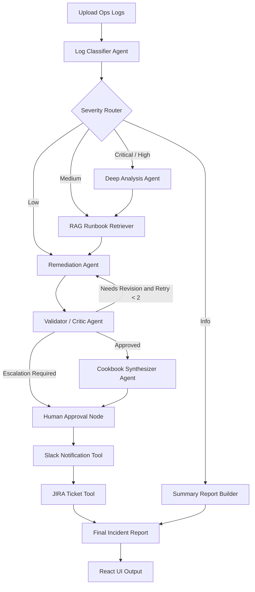

# OpsGPT — Multi-Agent DevOps Incident Analysis Suite

## Overview

OpsGPT is an autonomous AI-powered incident response and remediation platform designed to analyze operational logs, detect root causes, orchestrate intelligent remediation workflows, and generate actionable incident reports across distributed infrastructure environments.

The platform combines:
- LangGraph for multi-agent orchestration
- FastAPI for backend APIs
- React + Vite for modern frontend architecture
- OpenRouter/Gemini-powered LLM analysis
- RAG-grounded remediation workflows
- Structured AI validation pipelines
- Slack/JIRA operational integrations

The system demonstrates how GenAI agents can automate incident review, remediation mapping, escalation workflows, and cross-tool collaboration in a scalable production-oriented architecture.

---

# Problem Statement

Modern DevOps and SRE teams spend significant time:
- manually reviewing operational logs
- identifying root causes
- correlating incidents
- finding remediation procedures
- escalating critical incidents
- updating communication channels
- creating JIRA tickets

OpsGPT automates this workflow using collaborative AI agents.

---

# What the Platform Does

Users upload operational logs through a React dashboard.

The backend orchestrates multiple AI agents through a LangGraph DAG pipeline to:
1. Classify incidents
2. Determine severity
3. Retrieve operational runbooks
4. Generate remediation strategies
5. Validate remediation quality
6. Escalate critical incidents
7. Synthesize operational cookbooks
8. Create incident-ready markdown reports
9. Push notifications to Slack
10. Create JIRA tickets for severe incidents

---

# Core Multi-Agent Architecture

## Specialized AI Agents

### 1. Log Classifier Agent
Responsible for:
- parsing logs
- extracting structured incidents
- identifying services
- classifying error types
- assigning severity

File:
```text
agents/classifier.py
```

### 2. Severity Router Agent

| Severity | Workflow Path |
|---|---|
| Critical | Deep analysis + RAG + Validator + Human approval |
| High | Deep analysis + RAG + Validator |
| Medium | RAG + Remediation |
| Low | Standard remediation |
| Info | Summary-only reporting |

File:
```text
agents/severity_router.py
```

### 3. RAG Retriever Agent

Retrieves operational runbooks from:
```text
knowledge_base/
```

Uses BM25 retrieval to ground remediation in real operational documentation.

File:
```text
agents/rag.py
```

### 4. Remediation Agent

Generates:
- root cause explanations
- remediation rationale
- ordered recovery steps
- operational recommendations

Outputs are RAG-grounded against runbook knowledge.

File:
```text
agents/remediation.py
```

### 5. Validator / Critic Agent

Possible verdicts:
- approved
- needs_revision
- escalate

Capabilities:
- quality scoring
- retry loops
- escalation detection
- revision instructions

Maximum retry count:
```text
2 retries
```

File:
```text
agents/validator.py  
```

### 6. Cookbook Synthesizer Agent

Combines all incidents and fixes into a consolidated operational recovery checklist.

File:
```text
agents/cookbook.py
```

### 7. Notification Agent

Handles:
- Slack notifications
- threaded incident updates
- JIRA ticket creation

File:
```text
agents/notifier.py
```

---

# LangGraph Orchestration Workflow



---

# AI Guardrails & Reliability

## Instructional Guardrails

The LLM is forced into an:
```text
Expert SRE and DevOps Incident Analyst
```

persona through strong system instructions.

## Structural Guardrails

Structured outputs are enforced using:
- Pydantic v2 models
- JSON schema validation
- strict TypeScript interfaces

Benefits:
- predictable outputs
- frontend safety
- reduced hallucinations
- production-safe UI rendering

---

# Frontend Architecture

The frontend demonstrates:
- clean engineering
- scalable architecture
- reusable components
- typed APIs
- production-oriented UI patterns

## Frontend Stack

| Layer | Technology |
|---|---|
| Framework | React 19 |
| Bundler | Vite |
| Language | TypeScript |
| Styling | Tailwind CSS v4 |
| Animations | Framer Motion |
| Icons | Lucide React |

---

# Backend Stack

| Layer | Technology |
|---|---|
| API Framework | FastAPI |
| AI Orchestration | LangGraph |
| LLM Integration | OpenRouter / Gemini |
| AI SDK | langchain-openai |
| Models | Pydantic v2 |
| Testing | Pytest |

---

# Deployment Architecture

Production deployment uses:
- Kubernetes
- ArgoCD GitOps
- Harbor Registry
- Traefik Ingress
- cert-manager TLS

Deployment Flow:

```text
GitHub Push
    ↓
Self-hosted CI Runner
    ↓
Docker Build
    ↓
Harbor Registry
    ↓
ArgoCD Sync
    ↓
Kubernetes Deployment
```

---

# Alignment with Hackathon Requirements

| Requirement | Status |
|---|---|
| Multi-agent orchestration | Implemented |
| Log analysis agents | Implemented |
| Remediation agents | Implemented |
| Slack notifications | Implemented (stub) |
| JIRA ticketing | Implemented (stub) |
| LangGraph orchestration | Implemented |
| DevOps automation | Implemented |
| Structured outputs | Implemented |
| Scalable architecture | Implemented |
| RAG-based intelligence | Implemented |
| Validator feedback loop | Implemented |
| Human escalation workflows | Implemented |

---

# Final Summary

OpsGPT is a multi-agent AI SRE orchestration platform that autonomously analyzes operational incidents, retrieves remediation intelligence through RAG, validates recovery strategies, and coordinates enterprise response workflows across Slack and JIRA using LangGraph-driven agent collaboration.

The project demonstrates:
- advanced AI orchestration
- scalable engineering architecture
- operational automation
- production-oriented frontend/backend design
- enterprise-grade DevOps workflows
