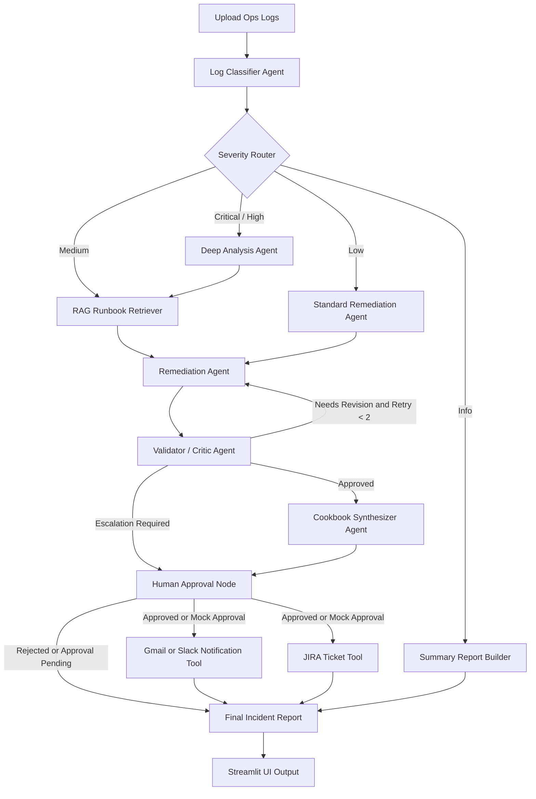

# C6 Hackathon — Group 4

**Multi-Agent DevOps Incident Analysis Suite**

Upload ops logs → 5 LangGraph agents analyze them → structured incidents, remediations, Slack notifications, JIRA tickets, and a consolidated runbook checklist.

---

## Table of Contents
- [What it does](#what-it-does)
- [Architecture](#architecture)
- [Project structure](#project-structure)
- [Setup](#setup)
- [Running the app](#running-the-app)
- [Demo logs](#demo-logs)
- [How the agents work](#how-the-agents-work)
- [Environment variables](#environment-variables)
- [Git workflow & branching](#git-workflow--branching)
- [Troubleshooting](#troubleshooting)

---

## What it does

You upload a log file. The system:

1. **Classifies** every distinct incident (service, error type, severity, evidence).
2. **Routes by severity** — critical/high go through deep analysis + RAG, medium goes through RAG, low through standard remediation, info gets a summary only.
3. **Recommends a fix** for each incident with rationale, ordered steps, and risk level (RAG-grounded against the runbook KB).
4. **Validates the remediation** with a critic agent that returns `approved`, `needs_revision`, or `escalate`. Weak remediations loop back for up to **2 retries**; critical incidents requiring escalation route through a human approval gate.
5. **Synthesizes a runbook** — one consolidated checklist across all incidents.
6. **Posts to Slack** as a threaded message *(stub — safe in demo mode)*.
7. **Files JIRA tickets** for `high` / `critical` severity only *(stub — safe in demo mode)*.
8. **Renders a final report** in Markdown.

All orchestrated as a LangGraph DAG with conditional routing. UI in Streamlit.

### Key features

- Multi-agent LangGraph workflow with **conditional routing**
- **Severity-based** branching (critical / high / medium / low / info)
- **RAG-grounded remediation** over the runbooks knowledge base (BM25)
- **Validator / critic** agent with structured verdict
- **Retry loop** for weak remediation (max 2)
- **Human approval / escalation** path for critical incidents
- **Mermaid architecture diagram** in this README
- Lightweight pytest suite for the router and validator

---

## Architecture



The workflow uses LangGraph conditional routing. Critical and high-severity
incidents are routed through deep analysis, RAG-backed remediation, validator
review, and human approval before external notifications or ticket creation.
Medium incidents use RAG and standard remediation, while low/info events
follow a lightweight summary path. The validator agent creates a feedback
loop by sending weak remediation outputs back for revision (capped at 2
retries) before final reporting.
        ┌─────────────────┐
        │   upload_logs   │  Streamlit file upload → raw text
        └────────┬────────┘
                 ▼
        ┌─────────────────┐
        │   classifier    │  LLM + structured output → list[Incident]
        └────────┬────────┘
                 ▼
        ┌─────────────────┐
        │   remediation   │  per-incident fan-out → dict[id, Fix]
        └────────┬────────┘
                 ▼
        ┌─────────────────┐
        │    cookbook     │  consolidated Checklist
        └────────┬────────┘
          ┌──────┴──────┐
          ▼             ▼
     ┌────────┐    ┌────────┐
     │  slack │    │  jira  │  (high/critical only)
     └────┬───┘    └───┬────┘
          └──────┬─────┘
                 ▼
        ┌─────────────────┐
        │   final report  │  rendered markdown in UI
        └─────────────────┘
```

---

## Project structure

```
C6_Hackathon-Group-4/
├── README.md
├── requirements.txt
├── .env.example              # copy to .env and fill in keys
├── .gitignore
│
├── agents/                   # all agent logic + LangGraph wiring
│   ├── __init__.py
│   ├── config.py             # loads .env, picks the model
│   ├── models.py             # Pydantic: Incident, Fix, Checklist, State
│   ├── classifier.py         # raw logs → list[Incident]
│   ├── severity_router.py    # routing decision (critical/high/medium/low/info)
│   ├── rag.py                # BM25 retrieval over runbooks/
│   ├── remediation.py        # incident → Fix (RAG-grounded)
│   ├── validator.py          # critic agent: approved / needs_revision / escalate
│   ├── cookbook.py           # all incidents → consolidated Checklist
│   ├── notifier.py           # Slack + JIRA stubs (safe in demo mode)
│   └── graph.py              # LangGraph StateGraph + conditional edges
│
├── app/
│   └── main.py               # Streamlit UI
│
├── tests/                    # pytest tests for the router + validator
│   ├── test_severity_router.py
│   └── test_validator.py
│
└── Sample_logs/              # pre-canned demo logs anyone can read
    ├── website_slow.log      # web app slowing down, DB query timeouts, 500s on checkout
    ├── login_failures.log    # brute-force attempts, account lockouts, SMTP failures
    ├── payment_errors.log    # card declines, gateway timeouts, Stripe rate limits, webhook failures
    └── disk_full.log         # backup fails, uploads fail, DB transactions rolled back
```

---

## Setup

### Prerequisites
- Python 3.11+
- An OpenRouter API key — sign up free at https://openrouter.ai, copy a key from https://openrouter.ai/keys

### One-time install

**macOS / Linux:**
```bash
git clone https://github.com/joyson-fernandes/C6_Hackathon-Group-4.git
cd C6_Hackathon-Group-4

python3 -m venv .venv
source .venv/bin/activate
pip install -r requirements.txt

cp .env.example .env
# open .env in your editor and paste your OPENROUTER_API_KEY
```

**Windows (PowerShell):**
```powershell
git clone https://github.com/joyson-fernandes/C6_Hackathon-Group-4.git
cd C6_Hackathon-Group-4

python -m venv .venv
.venv\Scripts\Activate.ps1
pip install -r requirements.txt

copy .env.example .env
# open .env in your editor and paste your OPENROUTER_API_KEY
```

---

## Running the app

**macOS / Linux:**
```bash
source .venv/bin/activate
streamlit run app/main.py
```

**Windows (PowerShell):**
```powershell
.venv\Scripts\Activate.ps1
streamlit run app/main.py
```

Opens at `http://localhost:8501`.

### Demo mode (no Slack/JIRA needed)

The notifier agents are stubbed out by default — they return placeholder values so the rest of the pipeline runs end-to-end without needing Slack or JIRA credentials. Pick this up in `agents/notifier.py` when ready.

### Verify the graph builds

Quick sanity check that all imports resolve and LangGraph wires up correctly:

```bash
python -c "from agents.graph import build_graph; g = build_graph(); print(g.get_graph().draw_mermaid())"
```

Prints the agent DAG as Mermaid — handy for the demo.

### Running tests

The severity router and validator are pure-Python and tested with `pytest`:

```bash
pip install pytest
pytest -q
```

Tests live under `tests/` and do not make any LLM calls.

---

## Demo logs

Four pre-built fixtures in `Sample_logs/` — drag-and-drop into the upload area in the UI. Each one tells a story any developer can follow at a glance:

| File | Story | Severity mix |
|---|---|---|
| `website_slow.log` | Pages load fast at first, then slow down → DB query timeouts → checkout starts returning 500s | 1 × high, 1-2 × warn |
| `login_failures.log` | Brute-force attack from one IP → account lockout → password-reset emails fail (SMTP down) | 1 × critical, 2 × warn |
| `payment_errors.log` | Card declines, gateway timeouts, Stripe rate-limited, webhook delivery failing, daily failure rate breach | 1 × critical, 2-3 × high |
| `disk_full.log` | Backup fails → uploads fail → DB can't extend → service partially down | 1 × critical, 1-2 × high |

Use `payment_errors.log` for the headline demo — it produces 4-5 incidents across multiple severities.

---

## How the agents work

### 1. Classifier (`agents/classifier.py`)
Single LLM call with **structured output** (Pydantic `IncidentList`). Prompt instructs the model to dedupe near-duplicates within a 5-minute window and use plain-English `error_type` labels.

### 2. Remediation (`agents/remediation.py`)
Loops over each incident, calls the LLM with that incident + a plain-English runbook of common patterns. Returns `Fix(rationale, steps, risk, runbook_ref)`.
Currently sequential — easy upgrade: parallelize with `asyncio.gather` or LangGraph `Send` API.

### 3. Cookbook synthesizer (`agents/cookbook.py`)
One LLM call over **all** incidents + their fixes → produces one consolidated `Checklist` ordered by impact.

### 4. Slack notifier (`agents/notifier.py::notify_slack`) — TO BE IMPLEMENTED
Stub returns `"not-implemented"`. Build it to post a parent message + one threaded reply per incident.

### 5. JIRA ticketer (`agents/notifier.py::file_jira`) — TO BE IMPLEMENTED
Stub returns `[]`. Build it to filter to `severity ∈ {high, critical}` and create one Bug per incident.

### State flow
A single `State: TypedDict` (in `models.py`) is threaded through all nodes by LangGraph. Each node returns a partial dict that gets merged.

---

## Environment variables

See `.env.example`. Required:

| Var | Purpose |
|---|---|
| `OPENROUTER_API_KEY` | LLM calls (required). Get one at https://openrouter.ai/keys |
| `OPENROUTER_MODEL` | Default: `anthropic/claude-sonnet-4.5`. Any OpenRouter model id works (e.g. `openai/gpt-4o`, `google/gemini-2.5-pro`, `meta-llama/llama-3.3-70b-instruct`) |
| `OPENROUTER_BASE_URL` | Default: `https://openrouter.ai/api/v1` (rarely change) |
| `SLACK_BOT_TOKEN` | When you implement notifier.py: `xoxb-...` from a Slack app with `chat:write` |
| `SLACK_CHANNEL` | `#hackathon-incidents` (bot must be invited) |
| `JIRA_URL` | `https://your-org.atlassian.net` |
| `JIRA_USER` | Your Atlassian account email |
| `JIRA_TOKEN` | API token from id.atlassian.com |
| `JIRA_PROJECT_KEY` | E.g. `OPS` |
| `DEMO_MODE` | `true` skips real Slack/JIRA calls (once implemented) |

**Never commit `.env`.** It's already in `.gitignore`.

---

## Git workflow & branching

We're working as a team in a tight time window — keep it simple.

### The golden rule
**Pull before you start. Push when you stop.**

```bash
git pull --rebase    # before any new work
# ... make changes ...
git add -A && git commit -m "what you did" && git push
```

### When to branch vs commit straight to main

| Situation | Action |
|---|---|
| Editing a file no one else is touching | Push to `main` directly |
| Editing the same file as someone else | Use a branch + PR |
| Risky change (refactor, swap a library) | Branch always |
| Fixing a typo / tweaking a prompt | Straight to `main` |

For a hackathon with a small team, branches add friction. Use them only when needed.

### Branch workflow (when you do need one)

A branch is a parallel timeline. You commit there freely without breaking `main`. When done, open a PR.

```
main:     A───B───C─────────────────M───
                   \               /
your branch:        D───E───F─────/
                                  ↑
                             PR merge
```

Steps:
```bash
git checkout main
git pull --rebase
git checkout -b yourname/short-description    # e.g. joyson/classifier-prompt

# work, commit, push
git add -A
git commit -m "tighten classifier prompt"
git push -u origin yourname/short-description

gh pr create --fill                            # opens PR in browser
# teammate reviews, clicks Merge
```

After merge, clean up:
```bash
git checkout main
git pull
git branch -d yourname/short-description
```

### Resolving merge conflicts

If `git pull --rebase` shouts CONFLICT:

```bash
# open the file, find:
#   <<<<<<< HEAD
#   your version
#   =======
#   their version
#   >>>>>>> their-commit
# delete the markers, keep the right combination, save
git add <file>
git rebase --continue
git push
```

### Useful commands

```bash
git status                    # what changed
git branch                    # list local branches
git log --oneline -10         # recent commits
git diff                      # unstaged changes
gh pr list                    # open PRs on GitHub
gh pr checkout <number>       # test a teammate's PR locally
```

---

## Troubleshooting

**`OPENROUTER_API_KEY is not set`** — copy `.env.example` to `.env` and fill in your key. Restart Streamlit.

**`structured_output` errors / model returns junk** — not every OpenRouter model supports JSON mode + tool calling. Stick to the defaults (`anthropic/claude-sonnet-4.5`, `openai/gpt-4o`, `google/gemini-2.5-pro`). Avoid the smaller open-weight models for the structured-output nodes.

**Classifier returns 0 incidents** — your log format may be too unusual. Try one of the bundled `Sample_logs/` first; if those work, paste a snippet of your real logs and tweak the prompt in `agents/classifier.py`.

**LangGraph mermaid render fails** — non-blocking; the rest of the pipeline still works. Needs internet to reach `mermaid.ink`.

**`UnicodeEncodeError` on Analyze** — make sure `agents/config.py` headers are ASCII-only (no em-dashes).

---

## Tech stack

- **LangGraph** 0.2+ — agent orchestration
- **langchain-openai** — pointed at OpenRouter (OpenAI-compatible API)
- **OpenRouter** — single API key, swap models freely (Claude, GPT, Gemini, Llama)
- **Pydantic** v2 — typed state + structured LLM output
- **Streamlit** — UI
- Default model: `anthropic/claude-sonnet-4.5` (override via `OPENROUTER_MODEL`)

---

## License

Hackathon project — do whatever, just don't blame us.
