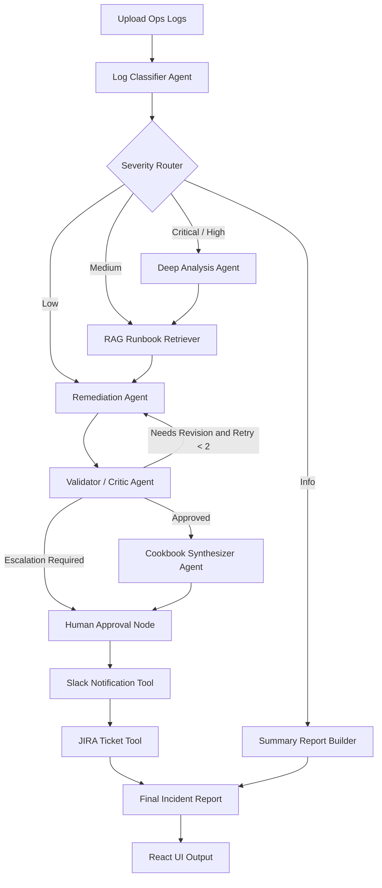

# C6 Hackathon — Group 4

**Multi-Agent DevOps Incident Analysis Suite**

Upload ops logs to a React UI → LangGraph agents on a FastAPI backend analyze them → structured incidents, RAG-grounded remediations, validator critic loop, optional human approval, Slack/JIRA fan-out, and a final markdown report.

---

## Stack

| Layer | Tech |
|---|---|
| Frontend | React 19 + Vite + TypeScript + Tailwind v4 + Framer Motion |
| Backend | FastAPI + LangGraph + langchain-openai (via OpenRouter) |
| Models | Pydantic v2 (typed state + structured LLM output) |
| RAG | BM25 over markdown runbooks in `knowledge_base/` |
| Default LLM | `anthropic/claude-sonnet-4.5` via OpenRouter (override with `OPENROUTER_MODEL`) |

---

## What it does

You upload a log file. The system:

1. **Classifies** every distinct incident (service, error type, severity, evidence).
2. **Routes by severity** — critical/high go through deep analysis + RAG, medium goes through RAG, low through standard remediation, info gets a summary only.
3. **Recommends a fix** for each incident with rationale, ordered steps, and risk level (RAG-grounded against the runbook KB).
4. **Validates the remediation** with a critic agent that returns `approved`, `needs_revision`, or `escalate`. Weak remediations loop back for up to **2 retries**; critical incidents requiring escalation route through a human approval gate.
5. **Synthesizes a runbook** — one consolidated checklist across all incidents.
6. **Posts to Slack** as a threaded message *(stub — safe in demo mode)*.
7. **Files JIRA tickets** for `high` / `critical` severity only *(stub — safe in demo mode)*.
8. **Renders a final report** in Markdown.

All orchestrated as a LangGraph DAG with conditional routing. Surfaced through a React UI (Dashboard, Incidents, Workflow, Integrations, History, Settings).

### Key features

- Multi-agent LangGraph workflow with **conditional routing**
- **Severity-based** branching (critical / high / medium / low / info)
- **RAG-grounded remediation** over the runbooks knowledge base (BM25)
- **Validator / critic** agent with structured verdict
- **Retry loop** for weak remediation (max 2)
- **Human approval / escalation** path for critical incidents
- **React + FastAPI** split — frontend talks to backend over `POST /api/analyze`
- Lightweight pytest suite for the router and validator

---

## Architecture



The workflow uses LangGraph conditional routing. Critical and high-severity
incidents are routed through deep analysis, RAG-backed remediation, validator
review, and human approval before Slack notifications and JIRA ticket
creation. Medium incidents use RAG before remediation, low incidents go
straight to remediation, and info-only logs follow a lightweight summary
path that bypasses remediation entirely. The validator agent creates a
feedback loop by sending weak remediation outputs back for revision (capped
at 2 retries) before final reporting.

---

## Project layout

```
C6_Hackathon-Group-4/
├── README.md
├── requirements.txt          # backend deps
├── .env.example              # copy to .env, fill in OPENROUTER_API_KEY
├── .gitignore
│
├── agents/                   # LangGraph agents and pipeline
│   ├── config.py             # OpenRouter LLM factory
│   ├── models.py             # Pydantic State, Incident, Fix, Checklist
│   ├── classifier.py         # raw logs → list[Incident]
│   ├── severity_router.py    # routing decision (critical/high/medium/low/info)
│   ├── rag.py                # BM25 retrieval over knowledge_base/
│   ├── remediation.py        # incident → Fix (RAG-grounded)
│   ├── validator.py          # critic agent: approved / needs_revision / escalate
│   ├── cookbook.py           # all incidents → consolidated Checklist
│   ├── notifier.py           # Slack + JIRA stubs (safe in demo mode)
│   └── graph.py              # LangGraph StateGraph + conditional edges
│
├── app/
│   ├── __init__.py
│   └── server.py             # FastAPI server (POST /api/analyze)
│
├── tests/                    # pytest tests for the router + validator
│   ├── conftest.py
│   ├── test_severity_router.py
│   └── test_validator.py
│
├── knowledge_base/           # markdown runbooks indexed by RAG at startup
├── Sample_logs/              # demo log fixtures
│
└── web/                      # React + Vite UI
    ├── index.html
    ├── package.json
    ├── vite.config.ts
    ├── tsconfig.json
    ├── .env.example          # copy to .env; VITE_API_URL=http://localhost:8000
    └── src/
        ├── App.tsx
        ├── main.tsx
        ├── index.css
        ├── pages/            # Dashboard, IncidentDetails, Workflow, Integrations, History, Settings
        ├── components/       # LogUploader, RemediationPanel, CookbookPanel, AgentWorkflowGraph, ui/*
        ├── hooks/            # useAnalysis, useIncidents
        ├── services/apiService.ts
        ├── store/AnalysisStore.tsx
        ├── types/            # Incident, AnalysisReport, etc.
        └── utils/            # cn, adapt (backend → frontend type mapping)
```

---

## API

**`POST /api/analyze`** — body `{ "logs": "<raw log text>" }` → returns:

```ts
{
  incidents: BackendIncident[],          // classifier output
  remediations: Record<string, BackendFix>, // keyed by incident.id
  cookbook: BackendChecklist | null,     // consolidated runbook
  report_md: string,                     // pre-rendered markdown report
  rag_sources: string[],                 // runbook filenames cited
  rag_confidence: 'high' | 'medium' | 'low' | 'none',
  rag_compliance: RagComplianceEntry[],  // severity-based policy verdicts
  slack_thread_ts: string | null,        // stub
  jira_keys: string[]                    // stub
}
```

See `web/src/types/incident.ts` for the full TypeScript shape.

---

## Setup

### Prerequisites
- Python 3.11+
- Node.js 20+
- An OpenRouter API key — sign up free at https://openrouter.ai, copy from https://openrouter.ai/keys

### Backend (FastAPI + LangGraph)

```bash
git clone https://github.com/joyson-fernandes/C6_Hackathon-Group-4.git
cd C6_Hackathon-Group-4

python3 -m venv .venv
source .venv/bin/activate
pip install -r requirements.txt

cp .env.example .env
# open .env and paste your OPENROUTER_API_KEY
```

### Frontend (React + Vite)

```bash
cd web
npm install
cp .env.example .env
# edit .env if your backend runs somewhere other than http://localhost:8000
```

---

## Running

You need **two terminals** — backend and frontend.

### Terminal 1: backend

```bash
source .venv/bin/activate
uvicorn app.server:app --reload --port 8000
```

- Health: http://localhost:8000/api/health
- Docs (Swagger): http://localhost:8000/docs

### Terminal 2: frontend

```bash
cd web
npm run dev
```

UI opens at http://localhost:3000.

### Smoke test (CLI, no UI)

```bash
curl -s -X POST http://localhost:8000/api/analyze \
  -H 'Content-Type: application/json' \
  --data "$(jq -Rs '{logs: .}' < Sample_logs/payment_errors.log)" | jq '.incidents | length, .rag_confidence'
```

Should print a number (incident count) and one of `high|medium|low|none`.

### Running tests

The severity router and validator are pure-Python and tested with `pytest`:

```bash
pip install pytest
pytest -q
```

Tests live under `tests/` and do not make any LLM calls.

---

## Demo logs

Drop one of these into the UI's uploader (or `curl` against `/api/analyze`):

| File | Story | Severity mix |
|---|---|---|
| `Sample_logs/website_slow.log` | DB query timeouts → 500s on checkout | 1 × high, 1-2 × warn |
| `Sample_logs/login_failures.log` | Brute-force attack → SMTP failures | 1 × critical, 2 × warn |
| `Sample_logs/payment_errors.log` | Card declines, gateway timeouts, Stripe rate limits | 1 × critical, 2-3 × high |
| `Sample_logs/disk_full.log` | Backup fails → uploads fail → DB partial down | 1 × critical, 1-2 × high |

Use `payment_errors.log` for the headline demo — produces 4-5 incidents.

---

## How the agents work

1. **Classifier** (`agents/classifier.py`) — single LLM call with structured output. Dedupes near-duplicates, uses plain-English `error_type` labels.
2. **Severity router** (`agents/severity_router.py`) — pure-Python branching. Decides which downstream path to take per the aggregate severity of the run.
3. **Remediation** (`agents/remediation.py`) — per-incident loop. For each one: BM25 retrieval over `knowledge_base/` → top-3 snippets fed into the prompt → structured `Fix(rationale, steps, risk, runbook_ref)`. Severity-based RAG policy enforces evidence requirements (`critical` = mandatory, `high` = strongly preferred, etc.).
4. **Validator** (`agents/validator.py`) — critic agent. Returns `approved`, `needs_revision`, or `escalate` with a `quality_score` and `revision_instruction`. Weak remediations loop back to the remediation agent for up to 2 retries.
5. **Cookbook synthesizer** (`agents/cookbook.py`) — one LLM call over all incidents + fixes → consolidated `Checklist`.
6. **Slack notifier** (`agents/notifier.py::notify_slack`) — **stub**. Returns `"not-implemented"`. Implement with `slack-sdk`.
7. **JIRA ticketer** (`agents/notifier.py::file_jira`) — **stub**. Returns `[]`. Implement with `atlassian-python-api`, filter to `severity ∈ {high, critical}`.
8. **Final report builder** (`agents/graph.py::build_report`) — pure Python. Walks the state and renders one markdown string.

State flow: `agents/models.py::State` is a TypedDict threaded through every node. Each node returns a partial dict that LangGraph merges in.

---

## Environment variables

### Backend (`.env`)

| Var | Purpose |
|---|---|
| `OPENROUTER_API_KEY` | LLM calls (required) |
| `OPENROUTER_MODEL` | Default `anthropic/claude-sonnet-4.5`. Any OpenRouter model id works |
| `OPENROUTER_BASE_URL` | Default `https://openrouter.ai/api/v1` |
| `LANGSMITH_TRACING` | Optional LangSmith tracing toggle. Keep `false` locally unless configured |
| `LANGSMITH_API_KEY` | Optional LangSmith API key. Leave empty to disable tracing |
| `LANGSMITH_PROJECT` | Optional LangSmith project name |
| `ENVIRONMENT` | Runtime label, e.g. `local` |
| `LOG_LEVEL` | Logging level, e.g. `INFO` |
| `CORS_ORIGINS` | Comma-separated allowlist for the FastAPI CORS middleware. Default covers `:3000` and `:5173` |
| `SLACK_BOT_TOKEN` | When notifier is implemented |
| `SLACK_CHANNEL` | When notifier is implemented |
| `JIRA_URL` / `JIRA_USER` / `JIRA_TOKEN` / `JIRA_PROJECT_KEY` | When JIRA filer is implemented |

### Frontend (`web/.env`)

| Var | Purpose |
|---|---|
| `VITE_API_URL` | Backend base URL. Default `http://localhost:8000` |

**Never commit `.env`.** Root and frontend env files are ignored; commit only `.env.example` files.

---

## Adding runbooks

Drop new `.md` files into `knowledge_base/`. Each `## Header` becomes a separately-retrievable BM25 chunk. They're indexed at server startup — restart `uvicorn` to pick up new files.

Future upgrade path: swap BM25 for semantic embeddings if the KB grows past ~50 docs (replace `_build_index()` in `agents/rag.py` with a LangChain `VectorStore`).

---

## Deployment (Joysontech homelab)

Public deployment lives at **https://opsgpt.joysontech.com** on the Joysontech K8s cluster. CI/GitOps follows the same pattern as Outpost.

### Architecture

```
GitHub push → Self-hosted runner (10.0.1.40) → Harbor → values.yaml bump → ArgoCD → K8s
                                                                                   │
                                                                                   ▼
                                                                  Traefik IngressRoute
                                                                  cert-manager letsencrypt-prod
                                                                  → opsgpt.joysontech.com
```

**Image:** `registry.joysontech.com/library/c6-hackathon:<version>-<date>-<sha>`
**Namespace:** `c6-hackathon`
**Helm chart:** `deploy/chart/`
**ArgoCD App:** `gitops/apps/tools/c6-hackathon.yaml` (managed in [the gitops repo](https://github.com/joyson-fernandes/gitops))

### One-time setup

Anything below is per-environment, not per-deploy.

**1. GitHub secrets** on this repo:
- `HARBOR_USERNAME` — Harbor account (CI uses it to push to `registry.joysontech.com`)
- `HARBOR_PASSWORD` — Harbor password

**2. DNS** — point `opsgpt.joysontech.com` at the cluster's Traefik external IP (same target as `outpost.joysontech.com` etc.). cert-manager handles the TLS cert via Let's Encrypt HTTP-01 once DNS resolves.

**3. (optional) ArgoCD webhook** — add `https://argocd.joysontech.com/api/webhook` to this repo's GitHub webhook settings, content type `application/json`, for instant sync. Without it, ArgoCD polls every ~3 min.

**4. (optional) Server-side OpenRouter fallback key.** Each teammate sets their own key via the Settings tab — that's the primary auth path and no Vault setup is needed. If you also want a cluster-wide default (so analyze works for users who haven't pasted a key yet), set `existingSecret` in `deploy/chart/values.yaml` to the name of a K8s Secret containing `OPENROUTER_API_KEY`. Easiest path: ExternalSecret + Vault:
```bash
vault kv put secret/c6-hackathon OPENROUTER_API_KEY=replace-with-openrouter-key
# then in values.yaml: externalSecret.enabled=true, existingSecret=c6-hackathon-secrets
```

### CI flow

`.github/workflows/ci.yaml` runs on every push to `main`:

| Job | What it does |
|---|---|
| `test` | npm ci + tsc build + pip install + pytest |
| `build-and-push` | docker build → push to Harbor → trivy scan (fail on CRITICAL/HIGH) |
| `bump-chart` | `sed`-update `deploy/chart/values.yaml` with the new tag → commit `[skip ci]` |

ArgoCD picks up the values.yaml change and reconciles the cluster (~3 min, or instant if the webhook is configured).

### Per-user OpenRouter key (Settings tab)

Each teammate can paste their own OpenRouter key in the Settings tab. It's stored in their browser's localStorage as `opsgpt:openrouter_api_key` and sent with each `/api/analyze` request as the `X-OpenRouter-API-Key` header. The backend overrides the env var for the duration of that single request (serialized via a mutex), so you never have to share the Vault key.

If no header is present, the backend falls back to whatever `OPENROUTER_API_KEY` is mounted from Vault — so the cluster works out of the box without any user intervention.

### Local Docker test

To verify the production image before pushing:

```bash
docker build -t c6-hackathon:local .
docker run --rm -p 8000:8000 \
  -e OPENROUTER_API_KEY=replace-with-openrouter-key \
  c6-hackathon:local

# Visit http://localhost:8000 — same code path as production.
```

### Rollback

ArgoCD UI → app `c6-hackathon` → History and Rollback → pick the last good sync. Or revert the `values.yaml` commit and ArgoCD will reconcile to the older image tag.

---

## Git workflow & branching

We're working as a team in a tight time window — keep it simple.

### The golden rule
**Pull before you start. Push when you stop.**

```bash
git pull --rebase
# ... make changes ...
git add -A && git commit -m "what you did" && git push
```

### When to branch vs commit straight to main

| Situation | Action |
|---|---|
| Editing a file no one else is touching | Push to `main` directly |
| Editing the same file as someone else | Use a branch + PR |
| Risky change (refactor, swap a library) | Branch always |
| Fixing a typo / tweaking a prompt | Straight to `main` |

### Branch workflow (when you do need one)

```bash
git checkout main && git pull --rebase
git checkout -b yourname/short-description
# work, commit, push
git push -u origin yourname/short-description
gh pr create --fill
```

After merge:
```bash
git checkout main && git pull
git branch -d yourname/short-description
```

---

## Troubleshooting

**`OPENROUTER_API_KEY is not set`** — copy `.env.example` to `.env` and fill in your key. Restart `uvicorn`.

**Frontend can't reach backend (CORS / network errors)** — check that `uvicorn` is running on `:8000` and `web/.env` has `VITE_API_URL=http://localhost:8000`. If you're running the frontend on a non-default port, add it to `CORS_ORIGINS` in the backend `.env`.

**`structured_output` errors / model returns junk** — not every OpenRouter model supports JSON mode + tool calling. Stick to the defaults (`anthropic/claude-sonnet-4.5`, `openai/gpt-4o`, `google/gemini-2.5-pro`). Avoid smaller open-weight models for the structured-output nodes.

**Classifier returns 0 incidents** — your log format may be too unusual. Try a bundled `Sample_logs/` first; if those work, paste a snippet of your real logs and tweak the prompt in `agents/classifier.py`.

**`UnicodeEncodeError` on analyze** — make sure `agents/config.py` headers are ASCII-only (no em-dashes).

---

## License

Hackathon project — do whatever, just don't blame us.
